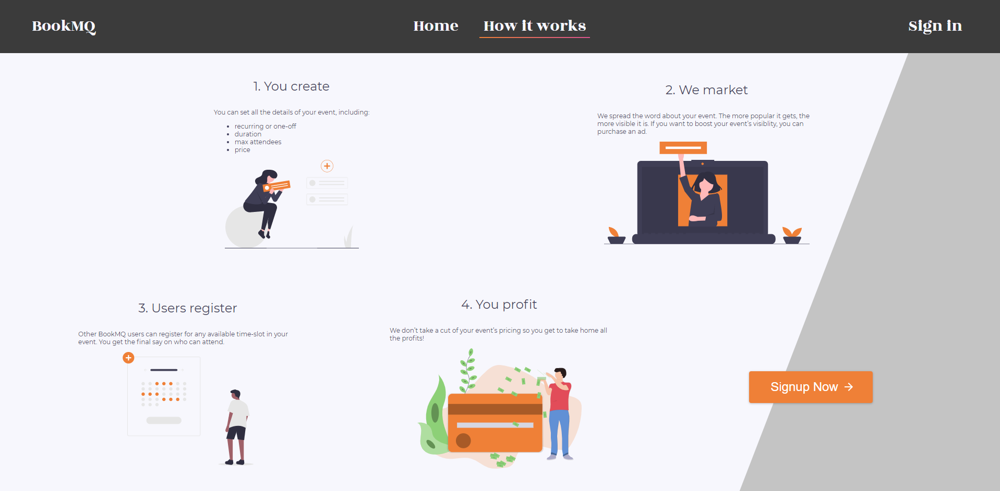
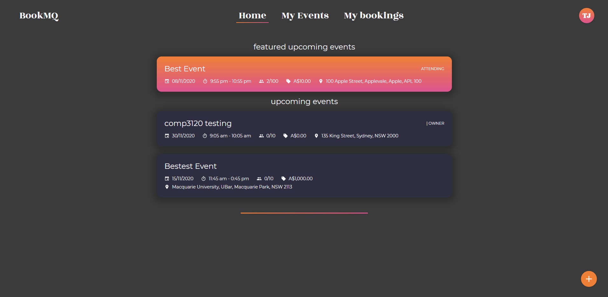

# Application and API Screenshots

- [Application and API Screenshots](#application-and-api-screenshots)
  - [BookMQ](#bookmq)
    - [Landing Page](#landing-page)
    - [Marketing Material Page](#marketing-material-page)
    - [User Registration](#user-registration)
    - [User Login](#user-login)
    - [User Profile](#user-profile)
    - [Following Users Tab](#following-users-tab)
    - [All Events](#all-events)
    - [My Events](#my-events)
    - [My Bookings](#my-bookings)
    - [Create Events Page](#create-events-page)
    - [View Event](#view-event)
  - [Swagger API Documentation](#swagger-api-documentation)

## BookMQ

### Landing Page

This is the page that greets all new visitors to the website and gives a very high level summary of what the website does.

### Marketing Material Page

This page describes the functionality of the website at a high level to try and sell the website's services. It features a Call to Action for users to sign up now.

### User Registration

This page provides visitors with a way to register a user account with the website.

### User Login

This page provides existing users a way to sign in to the website.

### User Profile

The user profile contains information such as the user's contact number, the number of events they are / have hosted, and the number of users they are following. Users can also see the "live" and "past" events on a user's profile, as well as who they are are following.

### Following Users Tab

This is a part of the profile page. It displays a list of users that are being followed by the owner of the profile being viewed. Users can click on a user card to view that user's profile page.

### All Events

This page lists all the events that are currently available, including upcoming and past events. Events are separated into `featured` and `normal` event sections if they are upcoming.

### My Events

This page provides a location for the user to look at the events they are hosting / have hosted.

### My Bookings

This page provides a location for the user to look at all the events they are / have attending.

## Create Events Page

This page allows users to create their very own event. It can be accessed by clicking the plus button at the bottom right hand side of the All Events / My Events pages.

## View Event

After an event is created, any authenticated user is able to view it. They will be able to see who is attending, all the details of the event, as well as the option to attend.

Owners of the event are given the option to `promote` it, which will make it show up under the `featured events` section of the all events page.

## Swagger API Documentation

Below shows our API documentation.

